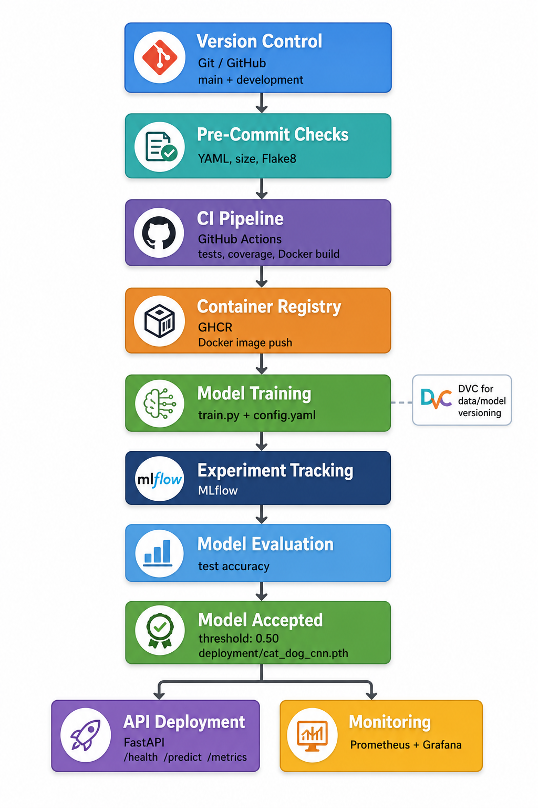

# Cats vs Dogs MLOps Pipeline

This repository contains an MLOps course project built around a small PyTorch
CNN for cats-vs-dogs image classification. The classifier is intentionally a
baseline; the main goal is to show the workflow around the model: versioning,
testing, training, tracking, containerization, local deployment, and monitoring.



## Implemented Components

- Git/GitHub version control with `main` and `development` branches.
- DVC for data and model versioning.
- Pre-commit checks for YAML, file hygiene, and Flake8.
- GitHub Actions CI with tests, coverage, Docker build, and GHCR image push
  using the commit SHA tag on push events.
- Config-based PyTorch training with MLflow tracking.
- Model acceptance using `accuracy_threshold: 0.50`.
- Local FastAPI deployment from `deployment/cat_dog_cnn.pth`.
- FastAPI `/health`, `/predict`, and `/metrics` endpoints.
- Docker and Docker Compose for the API, Prometheus, and Grafana.
- Scalable training experiments with DDP, AMP, and DeepSpeed/ZeRO.
- Scalable inference experiments with quantization, batch inference, pruning,
  and fine-tuning after pruning.
- Post-deployment experiments for continual learning and unlearning on MNIST.

## Final Model

- Accepted model path: `deployment/cat_dog_cnn.pth`
- Acceptance threshold: `0.50`
- Final accepted test accuracy: `0.5286`
- Model format: PyTorch `.pth`

The low threshold is deliberate for this project. It keeps the acceptance and
deployment path visible even though the classifier accuracy is limited.

## Repository Structure

```text
src/
  model.py                  CNN architecture
  train.py                  training, MLflow logging, acceptance, deployment
  api.py                    FastAPI inference and Prometheus metrics

experiments/
  scalable_training/        DDP, AMP, and DeepSpeed/ZeRO experiments
  scalable_inference/       quantization, pruning, timing, batch inference
  monitoring/               drift detection experiment
  post_deployment/          continual learning and unlearning experiments

configs/                    training configuration
deployment/                 accepted deployment model
monitoring/                 Prometheus and Grafana configuration
tests/                      unit/API tests
docs/                       model card, commands, final pipeline image
artifacts/                  generated plots and experiment outputs
.github/workflows/          CI workflow
```

## Setup

Install dependencies:

```powershell
pip install -r requirements.txt
```

If DVC-tracked files are missing locally:

```powershell
dvc pull
```

Run tests:

```powershell
pytest -q
```

Run Flake8:

```powershell
python -m flake8 src experiments tests
```

## Training and Tracking

Run the training pipeline:

```powershell
python -m src.train
```

Start the MLflow UI:

```powershell
mlflow ui --backend-store-uri mlruns
```

The training script reads `configs/config.yaml`, logs parameters and metrics to
MLflow, saves the trained model under `models/`, and copies accepted weights to
`deployment/cat_dog_cnn.pth`.

## Local API

Start FastAPI locally:

```powershell
uvicorn src.api:app --host 127.0.0.1 --port 8000
```

Useful URLs and endpoints:

- FastAPI docs: http://127.0.0.1:8000/docs
- `GET /health`
- `POST /predict`
- `GET /metrics`

## Docker and Monitoring

Run the local stack:

```powershell
docker compose up --build
```

Services:

- FastAPI: http://localhost:8000
- Prometheus: http://localhost:9090
- Grafana: http://localhost:3000

Grafana uses the local demo login:

```text
admin / admin
```

## Experiment Notes

Scalable training:

```powershell
python -m experiments.scalable_training.train_ddp
python -m experiments.scalable_training.train_deepspeed
```

Scalable inference:

```powershell
python -m experiments.scalable_inference.quantize
python -m experiments.scalable_inference.timing
python -m experiments.scalable_inference.infer
python -m experiments.scalable_inference.prune
python -m experiments.scalable_inference.finetune_prune
```

Monitoring and post-deployment experiments:

```powershell
python -m experiments.monitoring.drift
python -m experiments.post_deployment.continual
python -m experiments.post_deployment.unlearning
```

Recorded results include:

- Quantization latency: FP32 `0.004733`, INT8 `0.004309`, speedup `1.10x`.
- Fine-tuning after pruning: before `0.5286`, after `0.5214`.
- Yearly inference carbon estimate: around `2.45 g CO2eq`.

More commands are listed in `docs/run_commands.md`.

## Limitations

- The classifier accuracy is low; the project is primarily about the MLOps
  pipeline.
- Phone deployment was not completed.
- Cloud deployment was not completed.
- Deployment and monitoring are local only.
- Multi-node training was not fully validated.
- AMP is implemented in `experiments/scalable_training/train_ddp.py`, but no
  isolated non-AMP baseline was run.
- ZeRO was explored, but no meaningful VRAM saving claim is made.
- The local monitoring setup does not include production authentication, TLS,
  rate limiting, or alerting.
